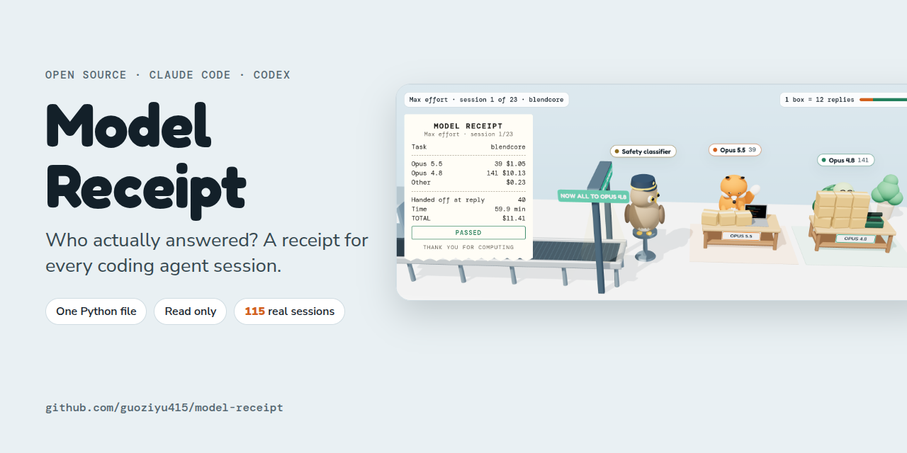
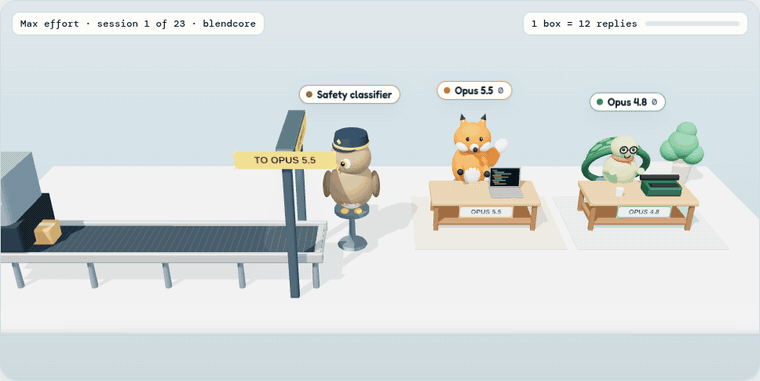
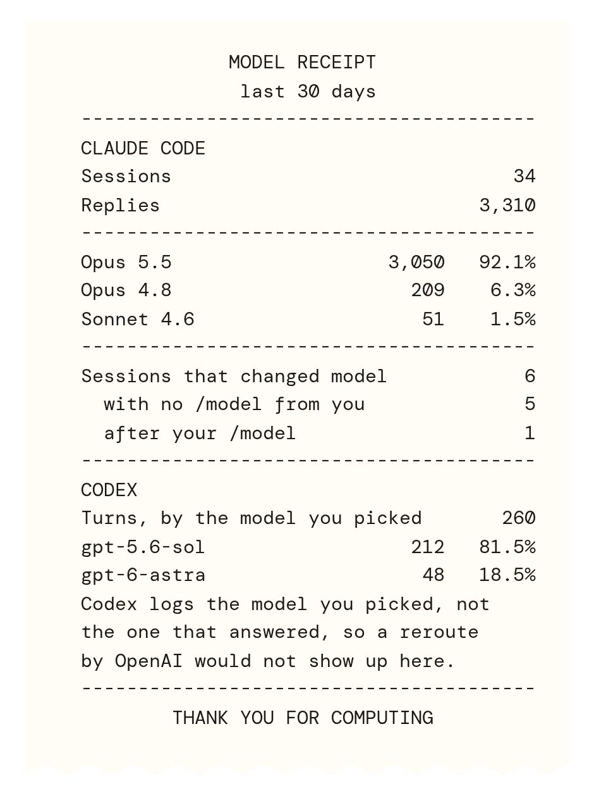
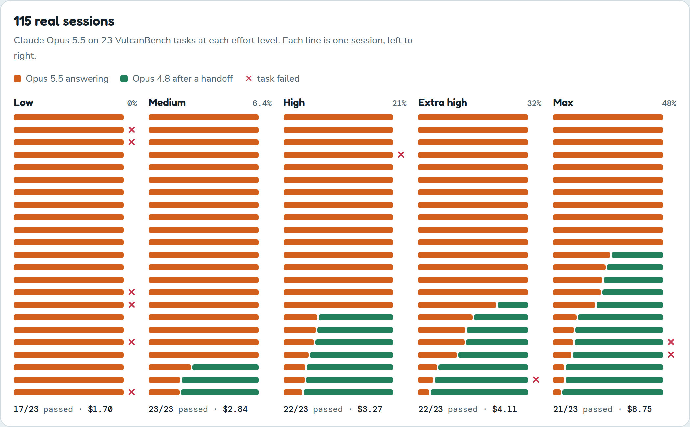

<p align="center">
  
</p>

<p align="center">
  <b>Who actually answered?</b> When a safety classifier refuses a request, Claude Code can finish the rest of the session on an older model.<br>
  Model Receipt reads the logs your coding agents already keep and prints a receipt of which model answered.
</p>

<p align="center">
  <a href="https://code415.dev/demos/2026-09-27/model-receipt"></a>
  
  
  
  <a href="LICENSE"></a>
</p>

<p align="center">
  <a href="https://code415.dev/demos/2026-09-27/model-receipt"><b>Live demo</b></a> ·
  <a href="#quick-start"><b>Quick start</b></a> ·
  <a href="#what-115-real-sessions-show"><b>Findings</b></a> ·
  <a href="#how-it-works"><b>How it works</b></a>
</p>

<br>

<p align="center">
  
</p>

<p align="center"><sub>A real VulcanBench session at max effort. The fox is Opus 5.5. The owl is the safety classifier, and it only steps in when it refuses a request. From then on the tortoise, Opus 4.8, answers everything else in the session. A receipt prints at the end.</sub></p>

## Quick start

```bash
curl -O https://raw.githubusercontent.com/guoziyu415/model-receipt/main/model_receipt.py
python3 model_receipt.py
```

<table>
<tr>
<td width="46%" valign="top"></td>
<td valign="top">

**What you get**

- Every Claude Code session on your computer, and how many replies each model wrote.
- Sessions that **changed model with no `/model` from you**, which is what a refusal fallback looks like.
- Sessions where **you** switched with `/model`, counted separately.
- Your Codex turns by the model you picked.
- A `model-receipt.json` file you can drop on the [live demo](https://code415.dev/demos/2026-09-27/model-receipt) to replay your own sessions in 3D.

**See it in 3D, locally**

```bash
git clone https://github.com/guoziyu415/model-receipt
cd model-receipt
python3 model_receipt.py view
```

<sub>The receipt on the left comes from <code>docs/sample-receipt.json</code>, which is made up.</sub>

</td>
</tr>
</table>

### Options

| Option | What it does |
|---|---|
| `--days N` | Only sessions that started in the last N days |
| `--find-all` | Search your whole home folder for Claude session logs. Slower, finds logs kept in unusual places |
| `--claude-dir DIR` | Also scan this folder, including gzipped `.jsonl.gz` logs. Repeat it for more folders |
| `--anonymize` | Replace project names with `project 1`, `project 2` and so on, before you share the file |
| `--no-codex` | Skip Codex logs |
| `-o FILE` | Where to write the JSON. Default `model-receipt.json` |

### Where it looks

| Place | What is there |
|---|---|
| `~/.claude/projects` | Claude Code sessions from your terminal or editor |
| `$CLAUDE_CONFIG_DIR/projects` | The same, if you moved the config folder |
| `~/Library/Application Support/Claude` on macOS | Sessions the Claude desktop app keeps on your computer |
| `~/.codex/sessions` | Codex sessions |

**Cloud sessions are not on your computer.** If you use Claude Code on the web or cloud tasks in the Claude app, the log lives in that cloud environment. Two ways to count them:

- Ask Claude to run `python3 model_receipt.py` inside that session.
- Or ask Claude to copy the session log to your computer, for example gzipped into `~/claude-cloud-logs/`, then run `python3 model_receipt.py --claude-dir ~/claude-cloud-logs`. Gzipped logs (`.jsonl.gz`) are read directly.

## How it works

- Claude Code writes one JSONL file per session, and every reply carries the name of the model that wrote it, for example `claude-opus-5-5`.
- Model Receipt counts replies per model, in order. A session that starts on one model and continues on another **changed model**.
- If you typed `/model` right before the change, it counts as **after your /model**. Otherwise it counts as **with no /model from you**.
- One reply can span several log lines, so replies are counted once per message id. Replies marked `<synthetic>` are skipped. Subagent replies are counted separately, because subagents can run on another model by design.
- **Codex** records the model you picked for each turn, not the one that answered. OpenAI does route some high risk cyber traffic to a less capable model, as the [GPT-5.3-Codex system card](https://deploymentsafety.openai.com/gpt-5-3-codex/cyber-safeguards) says, so the receipt lists your Codex models and states that a reroute would not show up.

> **Privacy.** It reads model names, reply counts, effort level, output token counts, timestamps and project folder names. It never reads your prompts, code or replies, never changes a setting and never sends anything anywhere. The demo page reads your JSON in the browser and uploads nothing.

## What 115 real sessions show

<p align="center">
  
</p>

[Morgan Linton's redacted traces](https://github.com/morganlinton/vulcanbench-opus55-traces): Claude Opus 5.5 on 23 legacy code reconstruction tasks at five effort levels, through Claude Code 2.1.280 with refusal fallback on, September 22 to 24, 2026.

| Effort | Passed | Cost per task | Replies by Opus 4.8 | Spend on Opus 4.8 | Sessions handed off |
|---|:-:|:-:|:-:|:-:|:-:|
| Low | 17/23 | $1.70 | 0.0% | 0% | 0 |
| Medium | **23/23** | $2.84 | 6.4% | 14% | 3 |
| High | 22/23 | $3.27 | 20.9% | 37% | 7 |
| Extra high | 22/23 | $4.11 | 32.4% | 50% | 8 |
| Max | 21/23 | **$8.75** | 47.8% | **72%** | 12 |

- **At max effort, 72% of the money went to Opus 4.8.** Most handoffs happened in the first fifth of a session.
- **Every failed task at high, extra high and max had a safety classifier step in.** The 6 failures at low were Opus 5.5 on its own.
- **Caveats.** All 30 handoffs were in the `cyber` category, and these tasks rebuild old binaries, which looks like reverse engineering. Ordinary coding may never trigger it. Each task ran once per level, so a gap of 2 tasks is within noise. Costs are Claude Code's list price estimates, not a bill.

`scripts/build_vulcanbench_data.py` rebuilds `data/vulcanbench-sessions.json` from the traces, so every number here can be checked.

## Files

```
model_receipt.py                   the scanner, standard library only
docs/index.html                    the 3D page, also works on GitHub Pages
docs/sample-receipt.json           a made up receipt for trying the page
data/vulcanbench-sessions.json     per session numbers derived from the traces
scripts/build_vulcanbench_data.py  how that file is built
```

## Credits

- Demo data: [VulcanBench Frontier v4 traces](https://github.com/morganlinton/vulcanbench-opus55-traces) by Morgan Linton.
- 3D: [three.js](https://threejs.org), MIT license.
- Made by [@Code415zg](https://x.com/Code415zg) for [Code415 Radar](https://code415.dev), a daily digest of what people are paying attention to in AI, LLMs and CS.

Not affiliated with Anthropic or OpenAI. [MIT license](LICENSE).
